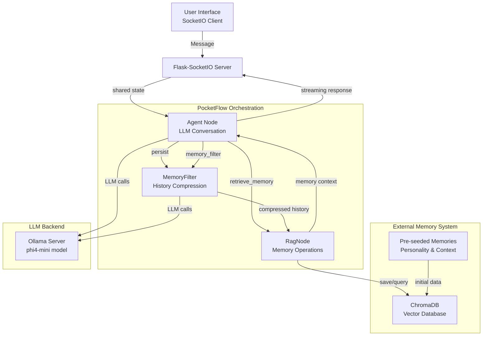

# Anemone: An AI Agent with Memory

🌊 A conversational AI agent with persistent memory, real‑time streaming, and a slick web interface.
Link to the slides that came with this presentation: https://docs.google.com/presentation/d/1u2YhjGfYm-s9Z8AQ1JfrNhnM4jqz_TmdwS3PMa-SON4/edit?usp=sharing

---

## Features

- **Conversational AI** – Powered by local LLM (Ollama, default `phi4‑mini`)
- **Persistent Memory** – ChromaDB vector storage with automatic retrieval/persistence
- **Real‑time Web UI** – Flask + Socket.IO for live streaming and memory notifications
- **Memory Management** – Summarization, retrieval, and persistence orchestrated via `pocketflow`
- **Dual Interface** – Web UI (`app.py`) and CLI (`main.py`)
- **Modular Architecture** – Easy to extend with new nodes

---

## Architecture

Anemone is built as a node‑based orchestration graph using [PocketFlow](https://github.com/AngeTheGreat/pocketflow). The agent decides when to access its external memory, which is stored as vector embeddings in ChromaDB.



### How Memory Works (Rudimentary External Memory)

Anemone’s memory system is intentionally simple – a great example of “rudimentary external memory”:

1. **Storage** – Conversation snippets are embedded and stored in ChromaDB as vectors.
2. **Retrieval** – Similarity search finds relevant memories based on current conversation.
3. **Persistence** – Long conversations are periodically saved to prevent context‑window overflow.
4. **Compression** – History is summarized every 10 loops to maintain conversational coherence.

**Memory Triggers**:
- **Active Recall** – Agent says `retrieve_memory` to access stored knowledge.
- **Automatic Persistence** – Every 25 loops, current conversation is saved.
- **History Management** – Every 10 loops, conversation is summarized to reduce token usage.

---

## Getting Started

### Prerequisites

- **Python ≥3.13**
- **[Ollama](https://ollama.ai/)** installed and running
- **Model pulled**: `ollama pull phi4‑mini`

### Installation

1. **Clone the repository**
   ```bash
   git clone https://github.com/yourusername/anemone.git
   cd anemone
   ```

2. **Install dependencies** (using [`uv`](https://github.com/astral-sh/uv))
   ```bash
   uv sync
   ```
   Or with pip:
   ```bash
   pip install -e .
   ```

3. **Seed the memory database** (pre‑populates quirky example memories)
   ```bash
   python seed_memory.py
   ```

4. **Verify installation** (optional)
   ```bash
   python check_install.py
   ```
   This will confirm all dependencies are available.

### Running the Web UI

```bash
python app.py
```
Open **http://localhost:5000** in your browser.

### Running the CLI

```bash
python main.py
```

---

## How It Works

### Core Components

| File | Purpose |
|------|---------|
| `app.py` | Flask‑SocketIO web server; handles real‑time messaging. |
| `main.py` | CLI interface for terminal‑based interaction. |
| `nodes.py` | Defines the three orchestration nodes: **Agent**, **RagNode**, **MemoryFilter**. |
| `orchestration.py` | PocketFlow graph that routes between nodes. |
| `memory.py` | Singleton wrapper for ChromaDB (persistent/HTTP/ephemeral). |
| `utils.py` | LLM utilities (streaming and non‑streaming calls to Ollama). |
| `seed_memory.py` | Pre‑seeds the vector DB with personality‑giving memories. |
| `templates/index.html` | Frontend UI with live updates and memory notifications. |

### The Orchestration Flow

1. **User input** arrives via SocketIO or CLI.
2. **Agent Node** processes the message using Ollama.
3. **Memory Decision** – Agent may output `retrieve_memory`, triggering the RagNode.
4. **RagNode** queries ChromaDB for similar memories and returns them as context.
5. **Agent** uses the retrieved memory to generate a final, context‑aware response.
6. **Periodic Tasks** – Every 10 loops the conversation is summarized; every 25 loops it is persisted.

---

## Example Interactions

### Web UI Demo
1. Start the server: `python app.py`
2. Open **http://localhost:5000**
3. Type *“Hello!”* – the agent will ask about its missing rubber ducky (pre‑seeded memory).
4. Watch the real‑time streaming and memory‑retrieval notifications.

### CLI Demo
```bash
$ python main.py
You: Hello!
Agent: Have you seen my rubber ducky? His name is Bartholomew and he's been missing.
```

---

## Troubleshooting

| Issue | Solution |
|-------|----------|
| **“Connection refused” to Ollama** | Ensure `ollama serve` is running. |
| **Model `phi4‑mini` not found** | Run `ollama pull phi4‑mini`. |
| **Port 5000 already in use** | Change port in `app.py` line 137. |
| **ChromaDB errors** | Delete the `./memory/` folder and re‑run `seed_memory.py`. |
| **Memory not being retrieved** | Check that `seed_memory.py` ran successfully. |
| **Import errors in IDE** | Language server may not see the virtual environment; the app will still run if dependencies are installed. |
| **Python not found (NixOS)** | Ensure Python ≥3.13 is available via `nix‑shell` or system packages. |

---

## Workshop Notes

### Quick Demo Commands
```bash
# Start Ollama (if not already running)
ollama serve &
# Pull the model (if not already present)
ollama pull phi4-mini
# Install dependencies
uv sync
# Seed memory
python seed_memory.py
# Launch the UI
python app.py
```

### Key Points to Highlight
- **External Memory** – Simple vector‑based storage/retrieval.
- **Node Orchestration** – PocketFlow directs flow based on agent output.
- **Real‑time Streaming** – UI updates as the LLM generates tokens.
- **Memory Triggers** – Agent decides when to remember/recall.

### Extending Anemone
- **Add a new node** – Inherit from `pocketflow.AsyncNode` and wire it into `orchestration.py`.
- **Change the model** – Edit `agent_model` / `memory_model` in `nodes.py`.
- **Modify prompts** – Update `agent_prompt` or `memory_filter_prompt` in `nodes.py`.

---

## License

MIT License – see [LICENSE](LICENSE) file.

---

## Acknowledgements

- [Ollama](https://ollama.ai/) for local LLM serving
- [ChromaDB](https://www.trychroma.com/) for vector storage
- [PocketFlow](https://github.com/AngeTheGreat/pocketflow) for node orchestration
- [Flask‑SocketIO](https://flask-socketio.readthedocs.io/) for real‑time web communication

---

*Built with ❤️ for the Saturday workshop.*
